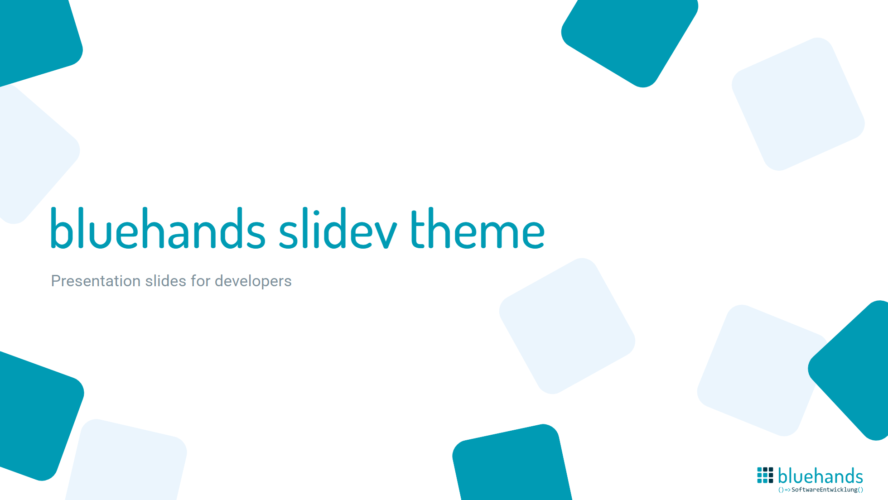
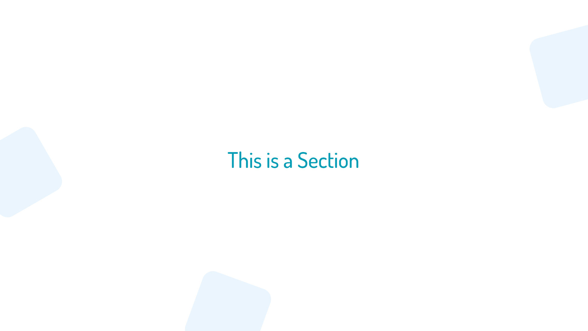
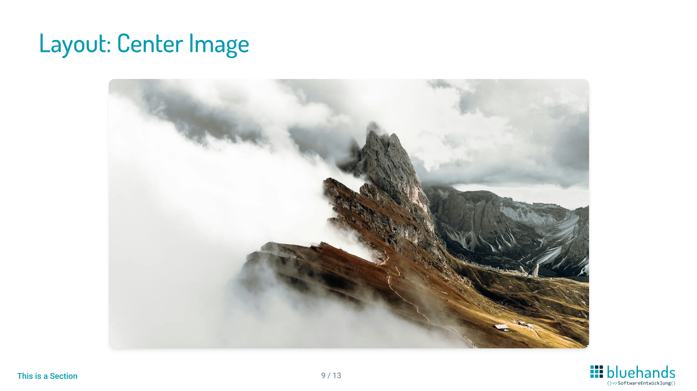
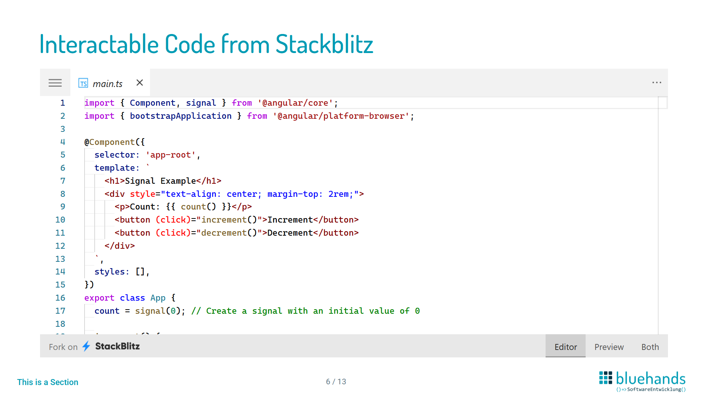
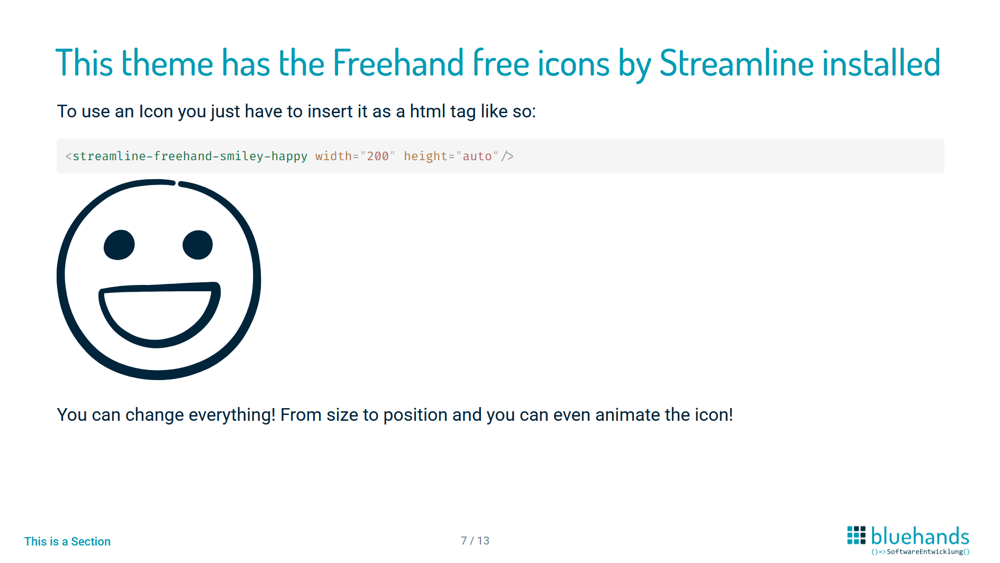

# slidev-theme-bluehands

<!-- [](https://www.npmjs.com/package/slidev-theme-bluehands-slidev-theme) -->

A bluehands theme in light mode for [Slidev](https://github.com/slidevjs/slidev).

<!--
  Learn more about how to write a theme:
  https://sli.dev/guide/write-theme.html
--->

<!--
  run `npm run dev` to check out the slides for more details of how to start writing a theme
-->

<!--
  Put some screenshots here to demonstrate your theme

  Live demo: [...]
-->

<!-- ## Install

Add the following frontmatter to your `slides.md`. Start Slidev then it will prompt you to install the theme automatically.

<pre><code>---
theme: <b>bluehands-slidev-theme</b>
---</code></pre>

Learn more about [how to use a theme](https://sli.dev/guide/theme-addon#use-theme). -->

## Usage

Add the following frontmatter to your `slides.md`.

<pre><code>---
theme: <b>relative/path/to/theme/folder</b>
---</code></pre>

Learn more about Slidev on https://sli.dev/

## Layouts

This theme provides the following layouts:

- cover
- section
- image-center

### Cover
`layout: cover`


### Section
`layout: section`


### Center Image
```
layout: center-image
image: ./path/to/image
```


> TODO:

## Components

This theme provides the following components:

- Stackblitz
- Footer
- Freehand free icons

### Stackblitz

```html
<div class="grid w-full">
  <Stackblitz id="stackblitz-starters-xmzqmx16" file="src%2Fmain.ts" theme="light"/>
</div>
```


### Footer

This theme has a footer with page numbering, bluehands logo and section title.
There is no footer on the first slide or on section slides.

### Freehand free icons

This theme comes with the freehand free icons by streamline preinstalled. Use them like this:

```html
<streamline-freehand-smiley-happy width="200" height="auto"/>
```



> TODO:

## Contributing

- `npm install`
- `npm run dev` to start theme preview of `example.md`
- Edit the `example.md` and style to see the changes
- `npm run export` to generate the preview PDF
- `npm run screenshot` to generate the preview PNG

## Credits

Freehand icons by Streamline — https://icon-sets.iconify.design/streamline-freehand/page-4.html, licensed under CC BY 4.0 ( https://creativecommons.org/licenses/by/4.0/)