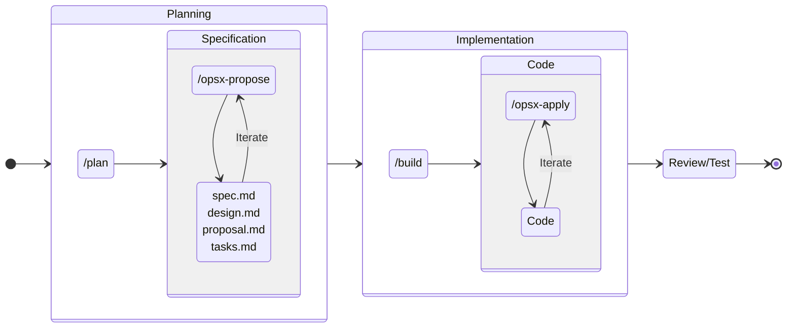

# Was wir heute machen werden (OpenSpec)

```mermaid
stateDiagram-v2
    direction LR
    [*] --> PlanMode

    state "Planning" as PlanMode {
        direction LR
        state "/plan" as PlanCommand
        
        state "Specification" as SpecWrapper {
            state "/opsx-propose" as WriteSpec
            state "spec.md<br>design.md<br>proposal.md<br>tasks.md" as Spec
            WriteSpec --> Spec
            Spec --> WriteSpec : Iterate
        }

        PlanCommand --> SpecWrapper
    }

    PlanMode --> BuildMode

    state "Implementation" as BuildMode {
        direction LR
        state "/build" as BuildCommand

        state "Code" as ImplementWrapper {
            state "/opsx-apply" as ImplementCode
            state "Code" as Code
            ImplementCode --> Code
            Code --> ImplementCode : Iterate
        }

        BuildCommand --> ImplementWrapper
    }

    state "Review/Test" as Review

    BuildMode    --> Review
    Review --> [*]
```

<!-- Notes: Hi I am a note -->