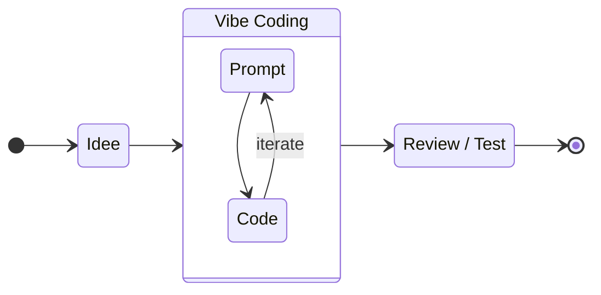

# Dev-Zyklus Vibe-Coding

```mermaid
stateDiagram-v2
    direction LR


    [*] --> Idee

    state "Vibe Coding" as VibeCoding {
        state "Prompt" as Prompt
        state "Code" as Code
        Prompt --> Code
        Code --> Prompt : iterate
    }

    Idee --> VibeCoding

    state "Review / Test" as Review

    VibeCoding --> Review
    Review --> [*]
```